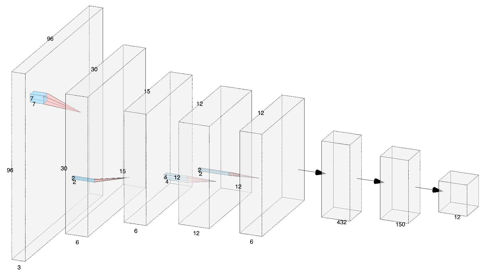
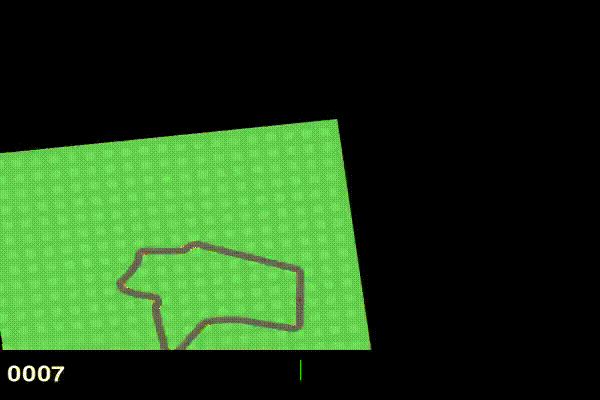
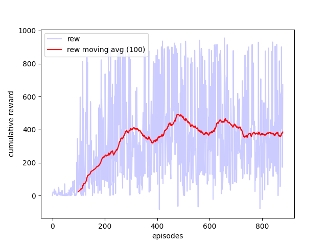

# Car Racing with DeepRL in Pytorch
This repository implements Deep Q Network (DQN) (CNN-based) using PyTorch to train a car in driving a virtual racetrack 
from OpenAI gym 🏎️🤖

## Usage

#### Installing Dependencies
Install all the dependencies in your environment

``` 
pip -r install requirements.txt
 ```

#### Testing

Test a pretrained model
``` 
python -m src.main_test -mod data/working_models/trial_660.h5
``` 

#### Training
Inspect and set up the configuration file in ``` src.config.Config```


``` 
class Config:

    SEED = 1

    STARTING_EPISODE_TRAIN = 0
    ENDING_EPISODE_TRAIN = STARTING_EPISODE_TRAIN + 1000

    STARTING_EPISODE_TEST = ENDING_EPISODE_TRAIN + 1
    ENDING_EPISODE_TEST = STARTING_EPISODE_TEST + 100

    SKIP_FRAMES = 2
    TRAINING_BATCH_SIZE = 64
    UPDATE_TARGET_MODEL_FREQUENCY = 5
    N_FRAMES = 3
    HIDDEN_DIMENSION_FC = 150
    
    GAS_WEIGHT = 1.3

    ACTION_SPACE = [
        (-1, 1, 0.2), (0, 1, 0.2), (1, 1, 0.2),  # .  Action Space Structure
        (-1, 1, 0), (0, 1, 0), (1, 1, 0),        # (Steering Wheel, Gas, Break)
        (-1, 0, 0.2), (0, 0, 0.2), (1, 0, 0.2),  # .  -1~1     0~1        0~1
        (-1, 0, 0), (0, 0, 0), (1, 0, 0)
    ]
``` 

Lunch the training.
``` 
python -m src.main_train
``` 

## Details

The underlying model is a DQN based on a CNN architecture implemented in Pytorch. Below the structure in detail. 



The input of the model is the **_STATE_** of the MDP: a _3x96x96_, that is 3 _96x96_ gray-scaled consecutive frames of the environment. 
The output is the q-value for each of the 12 actions. 

The **_ACTIONS_** are discretised in the ``` src.config.Config``` file. An action 
is a tuple representing in order: the **steering wheel** of the vehicle [-1,1], the **gas** [0, 1], the **break** [0,1]. 
We allow 12 actions: 

``` 
ACTION_SPACE = [
    (-1, 1, 0.2), (0, 1, 0.2), (1, 1, 0.2),  # .  Action Space Structure
    (-1, 1, 0), (0, 1, 0), (1, 1, 0),        # (Steering Wheel, Gas, Break)
    (-1, 0, 0.2), (0, 0, 0.2), (1, 0, 0.2),  # .  -1~1     0~1        0~1
    (-1, 0, 0), (0, 0, 0), (1, 0, 0)
]
``` 

Action _(-1, 1, 0)_ represent the car steering left at full speed.

The **_REWARD_** comes from the environment and is -0.1 every frame and +1000/N for every track tile visited, where N is the total number of tiles visited in the track. For example, if you have finished in 732 frames, your reward is 1000 - 0.1*732 = 926.8 points.

## Results
The agent in the early stage of learning _20 episodes_:


Cumulative rewards per epoch during training:


The agent in later stages of the learning process _500 episodes_:


## Credits and Resources
Training loop inspired by [@andywu0913](https://github.com/andywu0913/OpenAI-GYM-CarRacing-DQN). 
The environment is from [OpenAI Gym](https://www.gymlibrary.dev/environments/box2d/car_racing/)